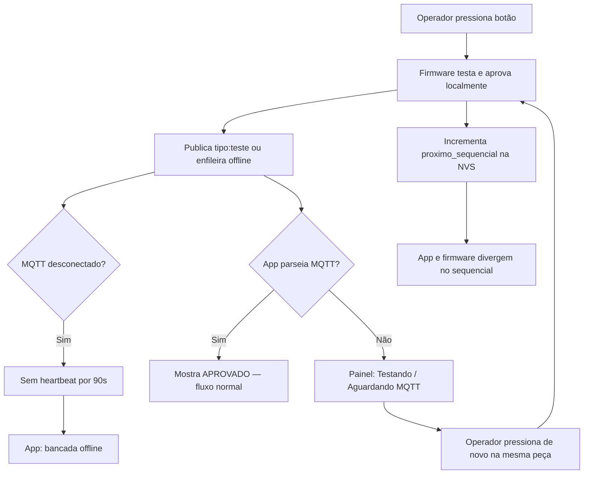

# Feature Specification: Lote sem reteste duplicado nem perda de sequência

**Feature Branch**: `006-batch-duplicate-sequence`

**Created**: 2026-07-09

**Status**: Draft

**Input**: Foi feito um lote em produção que funcionou até a quinta sirene; em seguida a bancada testou **3 vezes a mesma sirene**, **não validou** se foi aprovada, **perdeu a sequência** e o **dispositivo ficou offline**. Ao cadastrar outro lote, o problema se repetiu (**2 testes na mesma peça**).

## Problem Statement (observado em produção)

- Após ~5 aprovações consecutivas, o fluxo deixou de avançar o sequencial como esperado.
- O operador pressionou o botão várias vezes na **mesma peça** sem feedback claro de aprovação/reprovação.
- O painel e/ou firmware divergiram na contagem e no próximo serial esperado.
- A bancada passou a aparecer **offline** no app, interrompendo o lote.
- Em um **novo lote** cadastrado, o comportamento de **múltiplos testes na mesma peça** voltou a ocorrer.

## Clarifications

### Session 2026-07-09

- Q: Onde impedir reteste na mesma peça já aprovada (FR-004)? → A: **Ambos** — firmware bloqueia novo ciclo por janela pós-aprovação **e** app exibe aviso “peça já aprovada”.
- Q: O que define um “novo lote” limpo (FR-006)? → A: **Reset explícito** — `SET_BATCH` sempre zera `aprovados`, `proximo_sequencial` e `ultimo_veredito`, mesmo reutilizando a mesma OP.
- Q: Fonte da verdade do próximo sequencial esperado (FR-005/FR-010)? → A: **Firmware** — `proximo_sequencial` da NVS/heartbeat vence; app reconcilia para esse valor.
- Q: Fluxo quando MQTT cai mas bancada continua testando? → A: **Continuar local + aviso** — bancada testa com OLED; app mostra offline; **ao reconectar MUST reconciliar** `aprovados`, `proximo_sequencial` e números de série/etiquetas pendentes.
- Q: Chave canônica de deduplicação de resultados (FR-008)? → A: **`(numero_op, ts_ms)`** — um resultado físico por timestamp; alinhado à spec 003.

## User Scenarios & Testing

### User Story 1 — Um teste físico, um resultado claro (Priority: P1)

Como operador, preciso saber **imediatamente** se a peça foi aprovada ou reprovada antes de pegar a próxima, para não testar a mesma sirene várias vezes por dúvida.

**Why this priority**: O relato mostra 3 testes na mesma peça por falta de confirmação visual.

**Independent Test**: Iniciar lote de 10; testar 5 peças; cada toque deve gerar **um** veredito visível em até 3 segundos e liberar (ou bloquear) o próximo toque conforme regra do lote.

**Acceptance Scenarios**:

1. **Given** lote ativo e bancada online, **When** o operador conclui um teste físico, **Then** o painel mostra **APROVADO** ou **REPROVADO** antes de aceitar interpretação de “próxima peça”.
2. **Given** veredito **APROVADO** no último teste, **When** o operador olha o painel, **Then** vê contador de aprovados incrementado e o próximo sequencial esperado.
3. **Given** veredito **REPROVADO**, **When** o operador testa de novo **sem** modo reteste, **Then** o sistema indica que é reteste da mesma peça e **não** conta como nova aprovação na meta do lote.

---

### User Story 2 — Sequencial nunca “pula” nem “volta” (Priority: P1)

Como supervisor, preciso que o sequencial do lote avance de forma previsível (1, 2, 3…) e que reprovações na mesma peça não consumam serial de peça nova.

**Why this priority**: Perda de sequência gera etiquetas erradas e divergência com o firmware.

**Independent Test**: 5 aprovações + 2 reprovações no mesmo sequencial + 1 aprovação; sequencial final deve refletir 6 peças distintas aprovadas, não 8 toques físicos.

**Acceptance Scenarios**:

1. **Given** sequencial atual **N** e teste **aprovado**, **When** o ciclo termina, **Then** o próximo sequencial esperado é **N+1**.
2. **Given** sequencial **N** e teste **reprovado**, **When** o operador testa de novo na mesma peça, **Then** o sequencial permanece **N** até haver aprovação ou modo reteste explícito.
3. **Given** contador do firmware `aprovados_no_lote` e contador do app, **When** qualquer teste é processado ou heartbeat recebido, **Then** ambos permanecem alinhados; em divergência de sequencial, o valor do **firmware** (`proximo_sequencial` no heartbeat) prevalece e o app reconcilia.

---

### User Story 3 — Bloqueio contra “testar a mesma sirene 3x” sem intenção (Priority: P1)

Como operador, preciso de aviso ou bloqueio quando estou prestes a repetir teste na mesma peça sem ter mudado de peça, para evitar retrabalho e confusão.

**Why this priority**: Caso real — 3 testes na mesma sirene; novo lote — 2 testes na mesma peça.

**Acceptance Scenarios**:

1. **Given** último teste **APROVADO** no sequencial **N**, **When** o operador pressiona o botão novamente em menos de **5 segundos** sem nova peça na bancada, **Then** o firmware **rejeita** o novo ciclo, o painel exibe “Aguarde — peça já aprovada” (ou equivalente) e **nenhum** teste de produção é iniciado.
2. **Given** último teste **REPROVADO** no sequencial **N**, **When** o operador pressiona de novo, **Then** permite reteste no **mesmo** sequencial **N** e lista o novo resultado sem incrementar aprovados.
3. **Given** **modo reteste** ativo no app, **When** o operador testa, **Then** o ciclo roda mas **não** altera meta do lote nem emite etiqueta/serial.

---

### User Story 4 — Lote continua mesmo com MQTT instável (Priority: P1)

Como operador, preciso terminar o lote sem a bancada “sumir” do painel quando a rede oscila, para não perder sequência no meio da produção.

**Why this priority**: Dispositivo ficou offline durante o lote relatado.

**Acceptance Scenarios**:

1. **Given** lote ativo com 5 aprovados, **When** MQTT cai por até **60 segundos** e retorna, **Then** a bancada volta **online**, mantém OP e sequencial, o painel reconcilia **aprovados**, **próximo sequencial** e **números de série** (incluindo etiquetas pendentes da fila offline).
2. **Given** resultados na fila offline do firmware, **When** a conexão retorna, **Then** cada resultado é aplicado **uma vez**, contadores e seriais ficam consistentes com o firmware.
3. **Given** bancada offline por mais de **2 minutos** durante lote, **When** o operador abre o painel, **Then** vê estado explícito (offline + instrução “confira OLED da bancada” + último veredito conhecido), não tela vazia.
4. **Given** testes executados localmente durante queda de MQTT, **When** a conexão é restabelecida, **Then** o app atualiza contagem de aprovados e emite/sincroniza números de série que ficaram pendentes, sem duplicar resultados.

---

### User Story 5 — Novo lote começa limpo (Priority: P2)

Como operador, ao cadastrar um **novo lote**, preciso que contadores, sequencial e estado “testando” zerem, sem vazar dados do lote anterior.

**Why this priority**: Segundo lote também apresentou testes duplicados na mesma peça.

**Acceptance Scenarios**:

1. **Given** lote anterior encerrado ou cancelado, **When** o operador cadastra novo lote e o app envia `SET_BATCH` (mesma OP ou nova), **Then** firmware e painel iniciam com sequencial **1**, aprovados **0**, sem `ultimo_veredito` do lote anterior.
2. **Given** novo lote iniciado, **When** primeiro teste é executado, **Then** não há herança de “último veredito” ou sequencial do lote antigo no firmware nem no painel.
3. **Given** OP reutilizada (ex.: `00000`), **When** novo lote é aberto, **Then** histórico arquivado permanece no app, mas contadores ao vivo e sequencial do firmware refletem **apenas** a sessão nova.

---

## Edge Cases

- Aprovação no firmware mas painel ainda em “Testando” — operador não deve conseguir avançar sequencial no app até reconciliar.
- Heartbeat com `aprovados_no_lote` maior que contagem local — painel deve subir para o valor do firmware e reconciliar seriais pendentes.
- Dois toques rápidos no botão (bounce) — deve gerar no máximo um teste por debounce do hardware.
- Reprovação por falha hardware (PZEM) — não deve consumir sequencial de peça boa; operador vê causa clara.
- Fim de lote por meta atingida — novo teste bloqueado com mensagem `lote_cheio` legível.
- Replay MQTT com mesmo `ts_ms` — MUST NOT duplicar contagem nem número de série (dedupe `(numero_op, ts_ms)`).
- Troca de bancada no meio do dia — cada bancada mantém seu próprio lote ativo sem cruzar sequenciais.

## Requirements

### Functional Requirements

- **FR-001**: O sistema MUST exibir veredito **APROVADO** ou **REPROVADO** em até **3 segundos** após cada ciclo físico de teste.
- **FR-002**: O sistema MUST incrementar o sequencial **somente** após aprovação em modo produção normal.
- **FR-003**: O sistema MUST permitir múltiplos testes no **mesmo** sequencial **apenas** em caso de reprovação ou modo reteste explícito.
- **FR-004**: O sistema MUST **bloquear no firmware** e **alertar no painel** quando detectar novo teste na mesma peça já **aprovada** sem modo reteste (janela configurável, padrão **5 segundos** após aprovação). O firmware MUST rejeitar o botão; o app MUST exibir mensagem clara em português.
- **FR-005**: O painel MUST manter `aprovados`, `reprovados` e `sequencial esperado` alinhados com o firmware após cada mensagem processada ou reconciliação por heartbeat. Em divergência, o **firmware** (`proximo_sequencial` e `aprovados` no heartbeat) é a fonte da verdade; o app MUST reconciliar sem exigir ação do operador.
- **FR-006**: Ao iniciar novo lote (`SET_BATCH`), o sistema MUST **sempre** zerar estado volátil da sessão no firmware e no app (`aprovados=0`, `proximo_sequencial=1`, `ultimo_veredito` limpo, estado “testando”), **independentemente** de reutilizar a mesma OP. Histórico arquivado do lote anterior MUST permanecer intacto.
- **FR-007**: O sistema MUST recuperar lote ativo, sequencial e contadores após reconexão MQTT sem exigir recadastro manual do lote. Ao reconectar, MUST reconciliar `aprovados`, `proximo_sequencial` e **números de série/etiquetas** pendentes (fila offline + heartbeat) em uma única passagem consistente.
- **FR-008**: O sistema MUST publicar e processar **um** resultado por teste físico, deduplicando por **`(numero_op, ts_ms)`** (alinhado à spec 003). Replay MQTT, fila offline ou payload colado MUST NOT duplicar contagem, sequencial nem número de série.
- **FR-009**: Quando a bancada ficar offline durante lote ativo, o app MUST mostrar último estado conhecido, contagem parcial e aviso para **confiar no OLED da bancada** até reconciliar — não zerar o painel nem bloquear testes no firmware.
- **FR-010**: O operador MUST conseguir identificar no painel o **próximo número de sequencial** (`proximo_sequencial` do heartbeat/firmware) antes de posicionar a próxima peça — não apenas o sequencial do último teste exibido.

### Non-Functional Requirements

- **NFR-001**: Reconciliação de contadores, sequencial e seriais pendentes após reconexão MUST completar em até **10 segundos** com bancada online.
- **NFR-002**: Mensagens ao operador MUST estar em português claro (sem códigos técnicos como única informação).

### Key Entities

- **BatchSession**: OP ativa, quantidade meta, hora de início da sessão, bancada.
- **TestCycle**: sequencial, veredito, potência, timestamp único (`ts_ms`), origem (botão). Identidade de dedupe: **`(numero_op, ts_ms)`**.
- **LiveCounters**: aprovados, reprovados, sequencial esperado, estado da bancada (online/offline/testando).
- **RetestMode**: flag de sessão que desliga contagem na meta e emissão de etiqueta.

## Success Criteria

- **SC-001**: Em teste de bancada com lote de 10 peças, **zero** ocorrências de 3+ testes na mesma peça aprovada sem modo reteste.
- **SC-002**: Após 5 aprovações consecutivas, o sequencial esperado é **6** em app e firmware em **100%** dos ciclos observados.
- **SC-003**: Divergência entre contador do painel e `aprovados_no_lote` do firmware ocorre em **menos de 1%** dos testes em sessão de 1 hora.
- **SC-004**: Após queda de MQTT de até 60 segundos no meio do lote, **100%** das sessões recuperam sequencial, aprovados e seriais corretos sem recadastrar lote.
- **SC-005**: Ao abrir novo lote após o incidente relatado, **zero** vazamento de contagem ou sequencial do lote anterior na primeira hora de operação.

## Assumptions

- O operador usa **uma peça por vez** na bancada; múltiplos testes na mesma peça são erro de processo ou reteste de reprovada.
- A decisão de aprovação/reprovação continua **local na bancada**; esta feature foca em **sincronização, sequência e UX**, não em mudar limites de potência.
- Modo reteste já existe ou será tratado como flag explícita no app — reteste não conta para meta do lote.
- Reutilizar a mesma OP em lotes distintos é permitido; cada `SET_BATCH` de novo cadastro MUST ser tratado como sessão nova com reset completo (decisão sessão 2026-07-09).
- O **firmware** (NVS + heartbeat) é a fonte da verdade para `proximo_sequencial` e `aprovados` ao vivo; o app reconcilia em divergência (decisão sessão 2026-07-09).
- Durante queda de MQTT a bancada **pode** continuar testando localmente; ao reconectar, o app MUST atualizar aprovados e números de série (decisão sessão 2026-07-09).
- Deduplicação de resultados usa **`(numero_op, ts_ms)`** como chave canônica (decisão sessão 2026-07-09; alinha spec 003).
- “Dispositivo offline” inclui perda de MQTT e/ou heartbeat `presenca` por tempo prolongado.

## Out of Scope

- Substituição de hardware (PZEM, ESP32 queimado, Wi-Fi).
- Mudança de broker MQTT ou credenciais.
- Redesign completo do dashboard gerencial.

## Dependencies

- **003-test-flow-resilience** — dedupe canônico `(numero_op, ts_ms)`, estados Testando/Aguardando MQTT.
- **005-immediate-live-verdict** — veredito visível e contadores alinhados ao firmware.
- **001-fw-sw-compat** — contratos MQTT de lote, teste e heartbeat.

## Root Cause Analysis (auditoria do código — 2026-07-09)

Análise cruzada de `sirene_app` e `sirene-validator` contra o incidente relatado.

### Cadeia causal provável

### Sintoma → causa no código

| Sintoma observado | Causa provável | Onde no código |
|-------------------|----------------|----------------|
| 3 testes na mesma sirene sem validar aprovação | Firmware aceita novo teste após aprovação; app pode ficar em **Testando** / **Aguardando MQTT** sem timeout de recuperação | `batch_cmd_run_test_cycle` / botão em `main.c`; `mqtt_providers.dart` (`awaitingMqttResult` sem watchdog); `batch_live_widgets.dart` |
| Sequência perdida após ~5ª peça | Firmware incrementa sequencial **antes** do app processar MQTT; dedupe usa `(op, ts_ms, sequencial)` em vez de `(op, ts_ms)`; payloads MQTT colados podem gerar múltiplos testes por mensagem | `batch_cmd_apply_verdict`; `database.dart` `testExistsByOpTsMsSequencial`; `mqtt_parser.dart` `tryParseAllTestObjects` |
| Bancada offline no meio do lote | Heartbeat só publica se MQTT conectado; app marca offline após **90 s** sem `lastSeen`; LWT força `presenca: offline` | `telemetry.c`; `AppConfig.staleDeviceTimeout`; `mqtt_bridge.c` LWT |
| Novo lote repete teste na mesma peça | `SET_BATCH` com **mesma OP** preserva `aprovados` e `proximo_sequencial`; `ultimo_veredito` não é limpo; app filtra por `batchStartedAt` mas firmware continua sequencial da NVS | `batch_cmd_parse_set_batch` (linhas 627–673); `app_last_test_set` sem clear em `SET_BATCH`/`END_BATCH`; `batch_live_screen.dart` |

### Lacunas vs specs 003 / 005 / 006

| Spec | Item | Status atual |
|------|------|--------------|
| 003 | Dedupe por `(numero_op, ts_ms)` | **Parcial** — código usa `(op, ts_ms, sequencial)`; decisão: migrar para `(op, ts_ms)` (sessão 2026-07-09) |
| 005 | Veredito em ≤ 3 s; sair de Testando em ≤ 15 s | **Parcial** — só por evento MQTT/heartbeat; sem timer de escape |
| 005 | Fallback heartbeat quando `tipo:teste` falha | **Parcial** — `_tryProcessHeartbeatLastTest` cobre mal reprovados |
| 006 | FR-004 bloquear reteste em peça já aprovada | **Implementado** — firmware 1.8.4 + app cooldown 5 s |
| 006 | FR-006 estado limpo em novo lote | **Implementado** — reset explícito em todo `SET_BATCH` |
| 006 | FR-010 mostrar próximo sequencial esperado | **Implementado** — UI reconcilia `proximo_sequencial` do heartbeat |

## Risk Register (auditoria 2026-07-09)

Registro consolidado alinhado à constituição (`.specify/memory/constitution.md`). Sprint A corrige R01–R04.

### Críticos (P0)

| ID | Risco | Camada | Impacto | Status |
|----|-------|--------|---------|--------|
| R01 | NVS falha após GPIO de aprovação — LED aprova sem rastreio | Firmware | Aprovação sem serial/MQTT | **Corrigido** 1.8.6 |
| R02 | `sendEndBatch` finaliza localmente com MQTT down | App | App encerrado, firmware ativo | **Corrigido** Sprint A |
| R03 | `encerrado` do firmware limpa app sem lock/sync Firestore | App | Firestore `active`, app sem lote | **Corrigido** Sprint A |
| R04 | Serial duplicado insere aprovação com `serial: null` | App | Peça aprovada sem rastreio | **Corrigido** Sprint A |

### Altos (P1)

| ID | Risco | Camada | Mitigação |
|----|-------|--------|-----------|
| R05 | `peca_ja_aprovada` não enfileira offline | Firmware | `app_publish_or_queue` para rejeições |
| R06 | Fila offline drena sem PUBACK | Firmware | Pop após QoS1 ACK |
| R07 | Falha PZEM mid-test sem `tipo:teste` | Firmware | Publicar `teste/abortado` |
| R08 | Serial manual sem sync Firestore | App | `enqueueTestResult` após emissão manual |
| R09 | Fila laser travada (`markQueueFailed` não usado) | App | Cap retentativas + alerta no painel |
| R10 | Hold 5 s no botão reseta Wi-Fi com lote ativo | Firmware | Guard com `batch->active` |

### Médios (P2)

| ID | Risco | Camada | Mitigação |
|----|-------|--------|-----------|
| R11 | Watchdog 15 s ignora `heartbeat.fila > 0` | App | Estender watchdog com fila offline |
| R12 | Cooldown UI oculta card APROVADO | App | Overlay em vez de substituir hero |
| R13 | MessagePump engole exceções do handler | App | Retry ou alerta operador |
| R14 | Sync queue failed invisível no painel ao vivo | App | Banner quando `failed > 0` |
| R15 | Cooldown pós-aprovação só em RAM | Firmware | Persistir em NVS |
| R16 | Fila MQTT work depth 4 | Firmware | Aumentar para 16+ |
| R17 | `END_BATCH` em `HARDWARE_FAULT` | Firmware | Rejeitar sem flag admin |
| R18 | `nvs_flash_erase` global apaga lote + Wi-Fi | Firmware | Recovery por namespace |
| R19 | Dedupe `(op, ts_ms)` descarta testes se `ts_ms` colide | App | Monitorar colisões |
| R20 | `mergeFirmwareAprovados` sem validar sequencial | App | Reconciliar por sequencial |

### Mitigados (não reabrir sem evidência nova)

| Item | Mitigação |
|------|-----------|
| Duplo toque `botao_duplo` encerrava lote | Removido firmware 1.8.5 |
| Sem cooldown pós-aprovação | Firmware 1.8.4 + app 5 s |
| `SET_BATCH` mesma OP preservava contadores | Reset explícito spec 006 FR-006 |
| Dedupe `(op, ts_ms, sequencial)` | Migrado para `(op, ts_ms)` |
| Fila offline cheia (64 msgs) | Alerta `fila_cheia`; monitorar `fila_drops` |
| Payload MQTT colado múltiplos `tipo:teste` | Dedupe `(op, ts_ms)` |
| PZEM em falta (`HARDWARE_FAULT`) | Mensagem no painel (parcial) |

## Decisões resolvidas (sessão 2026-07-09)

| # | Tema | Decisão |
|---|------|---------|
| 1 | Bloqueio reteste peça aprovada | Firmware + app (FR-004) |
| 2 | Novo lote limpo | Reset explícito em todo `SET_BATCH` (FR-006) |
| 3 | Fonte da verdade sequencial | Firmware NVS/heartbeat (FR-005, FR-010) |
| 4 | MQTT down, bancada ativa | Continuar local + reconciliar aprovados/seriais ao voltar (FR-007, FR-009) |
| 5 | Dedupe de resultados | `(numero_op, ts_ms)` (FR-008) |
